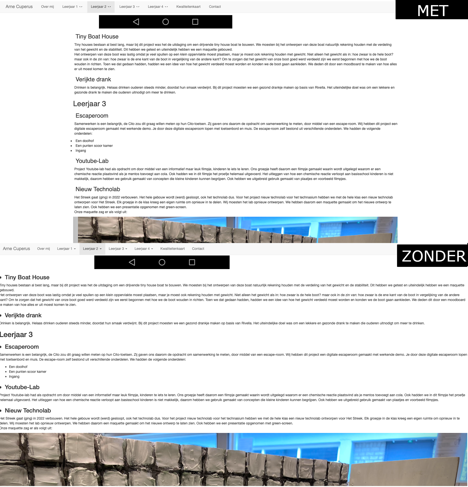

# Portfolio

Hoi, dit is mijn portfolio website. Op deze website vertel ik wat meer over mijzelf en de projecten die ik op school heb gedaan.

Bezoek hem op: https://penguix0.github.io/arnecuperus/

## Techniek

De website heb ik zelf geschreven, dit heb ik gedaan met behulp van HTML en CSS. HTML is een taal waarin veel websites worden geschreven. Je legt in HTML als ware de basis voor de website, met CSS regel je de opmaak. De meeste websites zien er zonder CSS er meestal heel lelijk en onoverzichtelijk uit. Hier is het verschil tussen mijn website met CSS en zonder CSS te zien:

Ook heb ik gebruik gemaakt van Bootstrap, dit is een frontend toolkit waarmee je moeilijke taken zoals een navigatiebalk maken veel makkelijker en sneller kan maken.